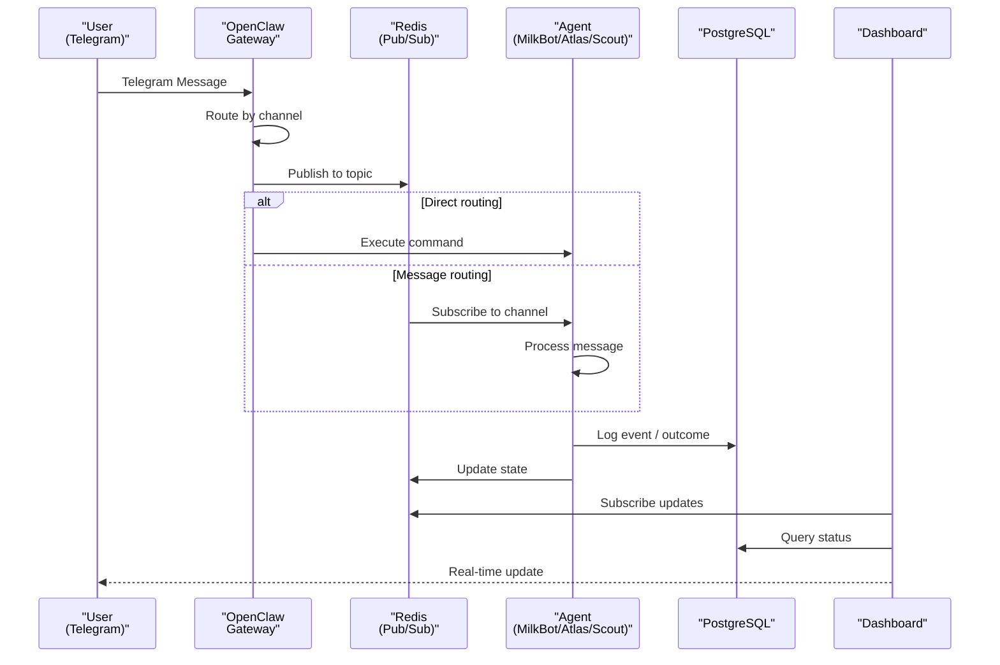

# OpenClaw Architecture Document

> "Every wall has a door. Every door has a lock. Every lock has a key." — SOUL.md

**Last Updated:** 2026-02-12
**Version:** 2026.2.9

## 1. Service Dependency Graph

### Systemd Units

| Service | Description | Dependencies |
|---------|-------------|--------------|
| `openclaw.service` | Main AI Gateway / Agent orchestrator | redis-server, postgresql |
| `openclaw-dashboard.service` | Streamlit monitoring dashboard (port 8501) | network, openclaw |
| `openclaw-atlas.service` | Atlas Resilience Engineer (Employee #002) | redis-server |
| `openclaw-scout.service` | Scout Market Intelligence (Employee #003) | redis-server |
| `openclaw-mission-worker.service` | Mission execution worker | redis-server, postgresql |
| `openclaw-heartbeat-bridge.service` | Gateway → Redis heartbeat relay | redis-server, openclaw |
| `openclaw-event-reactor.service` | Event-driven reaction engine | redis-server, postgresql |
| `openclaw-learning.service` | Outcome learning / pattern recognition | redis-server, postgresql |
| `openclaw-health.service` | Health check (runs every 30min) | network |
| `openclaw-backup.service` | Backup to Google Drive (runs every 6h) | network |
| `cloudflared.service` | Cloudflare Tunnel to dashboard.milkbot.ai | network |

### Mermaid: Service Dependency Graph

```mermaid
graph TD
    subgraph "Infrastructure"
        Redis[("Redis<br/>port 6379")]
        Postgres[(("PostgreSQL<br/>port 5432"))]
        Cloudflare[("Cloudflare<br/>Tunnel")]
    end

    subgraph "OpenClaw Core"
        Gateway[("OpenClaw<br/>Gateway")]
        Heartbeat["Heartbeat<br/>Bridge"]
    end

    subgraph "Agents"
        MilkBot["MilkBot #001<br/>CEO / Gateway"]
        Atlas["Atlas #002<br/>Resilience"]
        Scout["Scout #003<br/>Intelligence"]
    end

    subgraph "Workers"
        Mission["Mission<br/>Worker"]
        Event["Event<br/>Reactor"]
        Learning["Outcome<br/>Learning"]
    end

    subgraph "Monitoring"
        Dashboard["Dashboard<br/>:8501"]
        Health["Health<br/>Check"]
        Backup["Backup<br/>Service"]
    end

    Gateway --> Redis
    Gateway --> Postgres
    Gateway --> Cloudflare
    
    Heartbeat --> Redis
    Heartbeat --> Gateway
    
    MilkBot --> Redis
    MilkBot --> Postgres
    
    Atlas --> Redis
    Scout --> Redis
    
    Mission --> Redis
    Mission --> Postgres
    
    Event --> Redis
    Event --> Postgres
    
    Learning --> Redis
    Learning --> Postgres
    
    Dashboard --> Gateway
    Dashboard --> Redis
    Dashboard --> Postgres
    
    Health -.-> Gateway
    Health -.-> Redis
    Health -.-> Postgres
    
    Backup -.-> Cloudflare
```

### Service Dependency Details

```
openclaw-heartbeat-bridge.service:
  After=redis-server.service openclaw.service
  Wants=redis-server.service
  
openclaw-dashboard.service:
  BindsTo=openclaw.service
  After=openclaw.service network.target
  
cloudflared.service:
  After=network.target
  Wants=network.target
```

## 2. Data Flow Diagram

### Mermaid: Telegram → Gateway → Agents Flow



### Data Flow Summary

```
1. INGRESS:
   Telegram → cloudflared → Gateway (:8022)
   
2. ROUTING:
   Gateway → Redis PubSub channels → Agent processing
   
3. STORAGE:
   Agents → PostgreSQL (persistent state)
   Agents → Redis (ephemeral state, pub/sub)
   
4. MONITORING:
   Dashboard → Redis + PostgreSQL → Streamlit UI (:8501)
   
5. EGRESS:
   Alerts → Telegram (via alert-telegram.sh)
   Backups → Google Drive (via backup-to-drive.sh)
```

## 3. File System Layout

```
/opt/openclaw/
├── .openclaw/              # OpenClaw runtime data
│   ├── agents/            # Agent configurations
│   ├── canvas/            # Canvas sessions
│   ├── credentials/       # Encrypted credentials
│   ├── cron/              # Cron jobs (if any)
│   ├── devices/           # Paired devices
│   ├── identity/          # Agent identities
│   └── telegram/          # Telegram state
│
├── backups/               # Local backup archives
│   └── openclaw_backup_YYYYMMDD_HHMMSS.tar.gz
│
├── bin/                   # Utility binaries
│
├── config/                # Configuration files
│   ├── .env              # Environment variables (SECRET)
│   ├── .env.example      # Template (no secrets)
│   ├── providers/        # Provider configs
│   ├── context-limits.json
│   ├── failover.json
│   └── google-credentials.json (SECRET)
│
├── dashboard/             # Streamlit dashboard
│   ├── app.py            # Main dashboard
│   └── pages/            # Dashboard pages
│
├── logs/                  # Application logs
│   ├── health-check.log
│   ├── backup.log
│   ├── github-commit.log
│   ├── telegram.log
│   └── .alert_state/     # Rate limiting state
│
├── repo/                  # Git repository (workspace sync)
│   ├── *.md              # Documentation
│   ├── scripts/          # (NOT committed - in .gitignore)
│   └── .git/
│
├── scripts/               # Executable scripts
│   ├── health-check.sh
│   ├── backup-to-drive.sh
│   ├── github-commit.sh
│   ├── alert-telegram.sh
│   ├── auto-resume.sh
│   ├── mission-worker.sh
│   ├── event-reactor.sh
│   ├── outcome-learner.sh
│   └── ... (17 scripts total)
│
├── uploads/               # User uploads
│
├── venv/                  # Python virtual environment
│
└── workspace/             # Runtime workspace (git-synced)
    ├── *.md              # Operational docs
    ├── memory/           # Memory database
    ├── intelligence_agent/
    └── resilience_engineer/
```

### Key Directories

| Directory | Purpose | Backup? |
|-----------|---------|---------|
| `/opt/openclaw/config/.env` | Secrets & config | NO |
| `/opt/openclaw/workspace` | Operational docs | YES (Git + Drive) |
| `/opt/openclaw/logs` | Application logs | NO (rotated) |
| `/opt/openclaw/backups` | Backup archives | YES (Drive) |
| `/opt/openclaw/repo` | Git repository | YES (GitHub) |

## 4. Network Ports and Listeners

### Listening Services

| Port | Service | Protocol | Bind | Purpose |
|------|---------|----------|------|---------|
| **5432** | PostgreSQL | TCP | 127.0.0.1 | Database (local only) |
| **6379** | Redis | TCP | 127.0.0.1 | Cache & Pub/Sub (local only) |
| **8501** | Streamlit | TCP | 0.0.0.0 | Dashboard (via cloudflared) |

### External Connections

| Destination | Port | Purpose | Auth |
|-------------|------|---------|------|
| api.telegram.org | 443 | Telegram Bot API | Token |
| api.minimax.io | 443 | MiniMax LLM | API Key |
| openrouter.ai | 443 | OpenRouter LLM | API Key |
| api.search.brave.com | 443 | Brave Search | API Key |
| api.perplexity.ai | 443 | Perplexity | API Key |
| api.x.ai | 443 | Grok/xAI | API Key |
| github.com | 443 | Git operations | SSH Key |
| drive.google.com | 443 | Backup upload | OAuth |

### Cloudflare Tunnel

```
cloudflared tunnel --protocol h2mux \
    --hostname dashboard.milkbot.ai \
    --url http://localhost:8501
```

## 5. Agent Communication Channels

### Redis Pub/Sub Topics

| Channel | Publisher | Subscriber(s) | Purpose |
|---------|-----------|---------------|---------|
| `gateway:events` | Gateway | All agents | Incoming messages |
| `agent:heartbeat` | Heartbeat Bridge | Gateway | Agent liveness |
| `mission:queue` | Gateway | Mission Worker | Task distribution |
| `outcome:learn` | Agents | Learning Engine | Pattern recognition |
| `reaction:trigger` | Event Reactor | Relevant agents | Event-driven actions |

### Redis Keys (State)

| Key Pattern | Type | Purpose |
|-------------|------|---------|
| `agent:*:status` | Hash | Agent operational status |
| `mission:*:state` | Hash | Mission step state |
| `memory:*` | Various | Memory database |
| `circuit:breaker:*` | Various | Circuit breaker state |

### PostgreSQL Tables

| Table | Owner | Purpose |
|-------|-------|---------|
| `agent_events` | postgres | Event log |
| `agent_heartbeats` | postgres | Heartbeat tracking |
| `ops_missions` | binaryrogue | Mission definitions |
| `ops_mission_steps` | binaryrogue | Mission steps |
| `ops_outcomes` | binaryrogue | Learning outcomes |
| `ops_policy` | binaryrogue | Agent policies |
| `ops_reaction_rules` | binaryrogue | Event reaction rules |
| `task_queue` | binaryrogue | Task distribution |
| `ops_agent_events` | binaryrogue | Agent-specific events |

### Communication Flow

```
1. MESSAGE:
   Telegram → Gateway → Redis:gateway:events → Agent

2. RESPONSE:
   Agent → PostgreSQL:ops_outcomes → Redis:outcome:learn → Learning

3. HEARTBEAT:
   Agent → Redis → Heartbeat Bridge → Gateway

4. MISSION:
   Gateway → PostgreSQL:task_queue → Mission Worker → Agent

5. MONITORING:
   Dashboard → Redis + PostgreSQL → Streamlit UI
```

## 6. Agent Overview

### Employee Roster

| # | Agent | Role | Domain | Status |
|---|-------|------|--------|--------|
| 001 | MilkBot | CEO | Strategy, code, infrastructure | Active |
| 002 | Atlas | Resilience Engineer | Monitoring, self-healing, uptime | Active |
| 003 | Scout | Market Intelligence Officer | Research, signals, opportunities | Active |

### Agent Capabilities

**MilkBot (#001) - CEO**
- Gateway routing and orchestration
- Primary LLM provider management (MiniMax, OpenRouter)
- Telegram command handling
- Strategic decision-making

**Atlas (#002) - Resilience Engineer**
- Health monitoring and circuit breaker
- Auto-recovery and failover
- Resource monitoring
- System hardening

**Scout (#003) - Market Intelligence Officer**
- Web research (Brave, Perplexity)
- Signal detection and analysis
- Opportunity identification
- Market monitoring

## 7. Security Model

### Secrets Management

```
config/.env (RESTRICTED - 600 permissions)
├── API keys (MiniMax, OpenRouter, Brave, Perplexity)
├── Telegram credentials
├── Cloudflare API token
├── GitHub SSH key path
├── Gmail app password
├── Google Drive credentials
└── PostgreSQL password

CREDENTIALS ARE NEVER:
- Committed to git
- Logged to files
- Exposed via API
```

### Network Isolation

```
EXPOSED (via cloudflared):
- Port 8501 (dashboard.milkbot.ai)

LOCAL ONLY:
- PostgreSQL (:5432) - 127.0.0.1
- Redis (:6379) - 127.0.0.1
```

### Access Control

- **SSH**: Key-based only, user `milkbot`
- **PostgreSQL**: User `binaryrogue` (limited privileges)
- **Systemd**: Services run as `milkbot` where possible
- **Telegram**: Bot token + user ID verification

## 8. Operational Checklists

### Health Check (30 min interval)

- [ ] `openclaw.service` running
- [ ] `openclaw-dashboard.service` running
- [ ] PostgreSQL responding on :5432
- [ ] Redis responding on :6379
- [ ] Telegram bot reachable
- [ ] Disk usage < 80%
- [ ] Memory > 256MB available
- [ ] Cloudflare tunnel active

### Backup (6 hour interval)

- [ ] Create local tarball
- [ ] Verify archive integrity
- [ ] Upload to Google Drive
- [ ] Prune old local backups (>30)
- [ ] Log success/failure

---

*Document generated from deployed configuration*
*Version: 2026.2.9*
